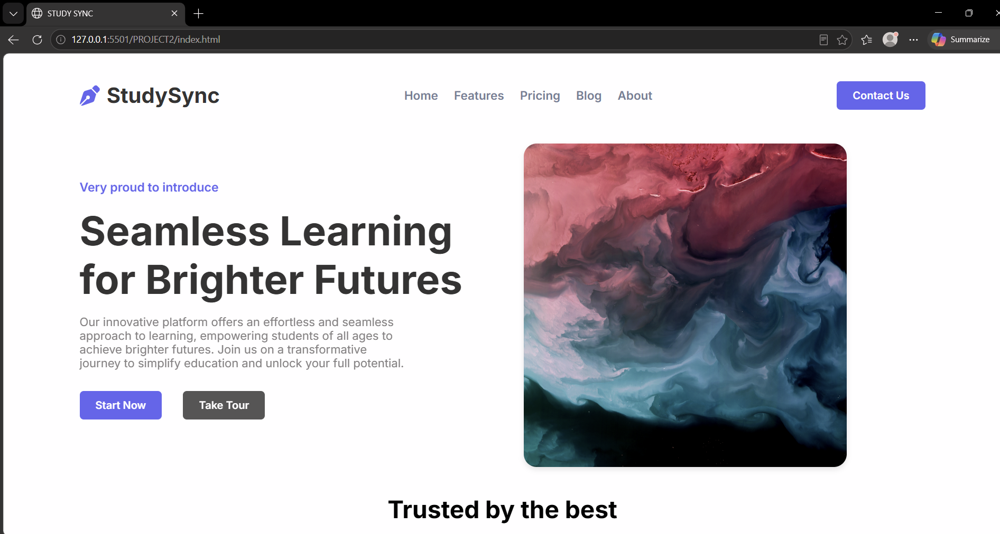
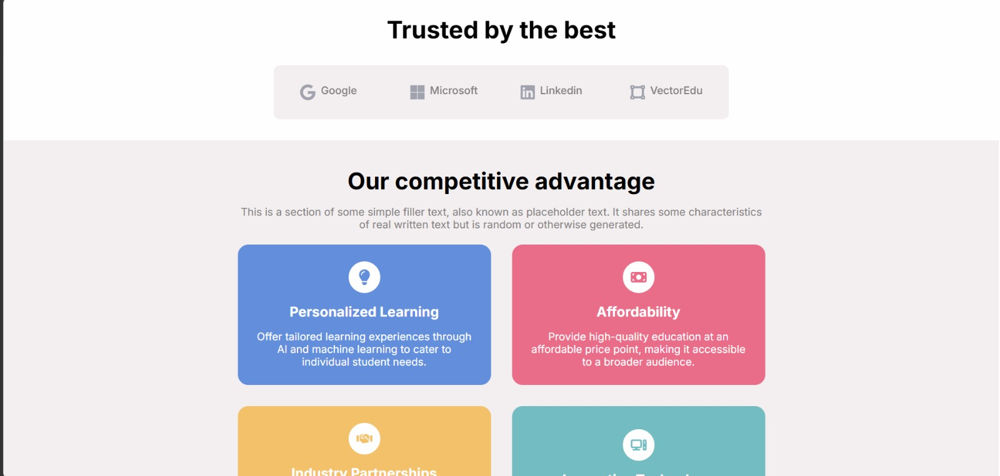
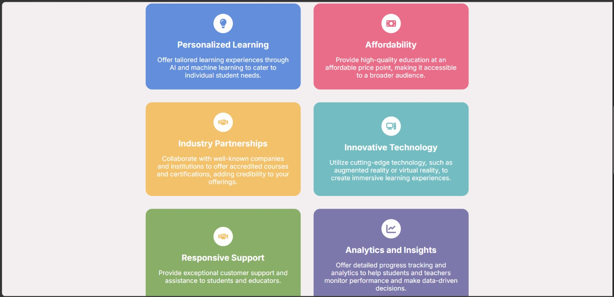
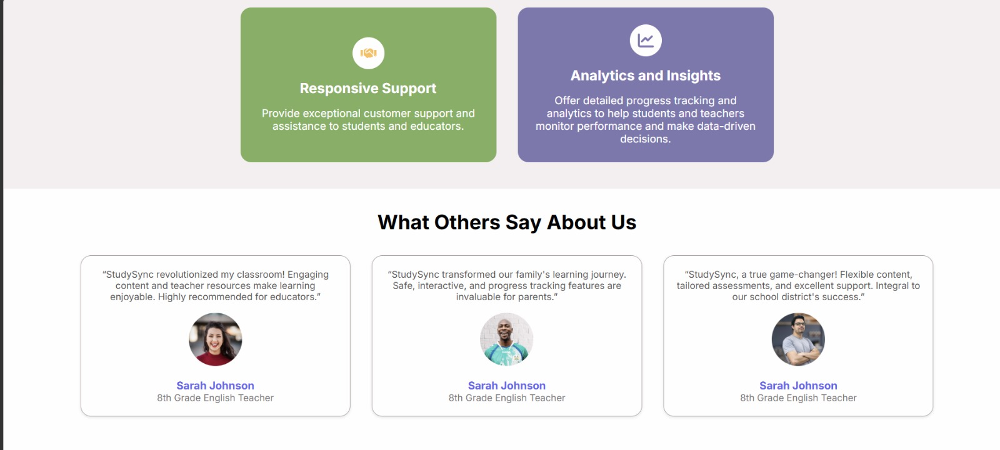
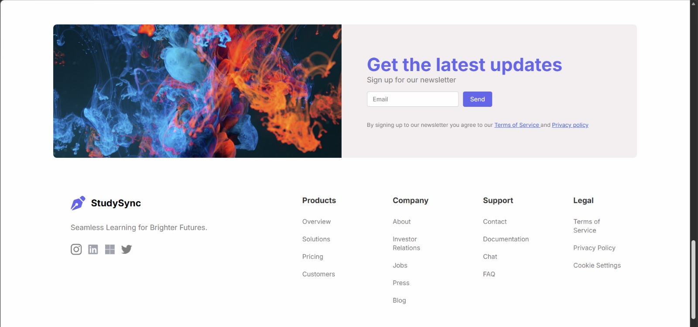

# 📚 StudySync - Educational Landing Page

StudySync is a modern, responsive educational landing page built using HTML5 and CSS3. The project is designed to promote an online learning platform by showcasing its features, benefits, testimonials, trusted partners, and newsletter subscription section through a clean and engaging user interface.

The website follows modern web design principles and provides an excellent user experience across desktop, tablet, and mobile devices.

---

## 🚀 Project Overview

StudySync aims to simplify online education by offering a seamless learning experience for students of all ages. This landing page demonstrates how an educational platform can effectively present its services, attract users, and build trust through testimonials and partnerships.

---

## ✨ Features

### 🔹 Responsive Navigation
- Company logo and branding
- Navigation links
- Contact button
- Mobile hamburger menu

### 🔹 Hero Section
- Attractive heading and description
- Call-to-action buttons
- Responsive hero image
- Smooth entrance animation

### 🔹 Trusted Companies Section
Showcases companies and organizations that trust the platform.

### 🔹 Features Section
Highlights the platform's competitive advantages:
- Personalized Learning
- Affordability
- Industry Partnerships
- Innovative Technology
- Responsive Support
- Analytics and Insights

### 🔹 Testimonials Section
Displays user feedback and reviews to build credibility and trust.

### 🔹 Newsletter Subscription
Allows users to subscribe for updates and announcements.

### 🔹 Footer Section
Contains:
- Product Links
- Company Information
- Support Resources
- Legal Information
- Social Media Icons

---

## 🛠️ Technologies Used

| Technology | Purpose |
|------------|----------|
| HTML5 | Structure of the website |
| CSS3 | Styling and Layout |
| Flexbox | Responsive alignment |
| CSS Grid | Section layouts |
| Media Queries | Responsive Design |
| CSS Animations | Smooth visual effects |

---

## 📂 Project Structure

```text
StudySync/
│
├── index.html
├── style.css
│
├── images/
│   ├── StudySyn.svg
│   ├── Google.svg
│   ├── Microsoft.svg
│   ├── linkedin.svg
│   ├── VectorEdu.svg
│   ├── Hamburger.svg
│   ├── PersonalizedLearn.svg
│   ├── Affordability.svg
│   ├── IndustryPatner.svg
│   ├── InnovativeTech.svg
│   ├── Analytics.svg
│   ├── avatar1.png
│   ├── avatar2.png
│   ├── avatar3.png
│   ├── instagram.svg
│   ├── twitter.svg
│   ├── img.png
│   └── other assets
│
└── README.md
```

---

## 🎯 Website Sections

### 1. Header
The header contains:
- StudySync logo
- Navigation menu
- Contact button
- Mobile menu button

### 2. Hero Section
Introduces the platform with:
- Eye-catching title
- Description
- Action buttons
- Featured image

### 3. Trusted Companies
Displays company logos that endorse or collaborate with the platform.

### 4. Features Section
Highlights the key benefits offered by StudySync through colorful feature cards.

### 5. Testimonials
Shows reviews from educators and users to increase credibility.

### 6. Newsletter Section
Allows visitors to subscribe using their email addresses.

### 7. Footer
Provides quick access to:
- Product Pages
- Company Information
- Support Resources
- Legal Policies
- Social Media Links

---

## 📱 Responsive Design

The website is fully responsive and optimized for:

### Desktop
- Full navigation menu
- Two-column layouts

### Tablet
- Flexible grids
- Adjusted spacing and typography

### Mobile
- Hamburger menu
- Single-column layouts
- Responsive images and cards

Media Queries ensure smooth adaptation across various screen sizes.

---

## 🎨 Design Features

- Modern UI Design
- Clean Typography using Inter Font
- Consistent Color Scheme
- Hover Effects
- Card-Based Layout
- Smooth Animations
- Mobile-Friendly Interface

---

## ⚡ Animation Effects

The project includes:

### Slide From Left Animation
Used in:
- Hero Content
- Company Section

### Hover Effects
Applied to:
- Buttons
- Testimonial Cards
- Navigation Links

---

## 🔧 Installation & Setup

### Method 1: Download ZIP

1. Download the project files.
2. Extract the ZIP folder.
3. Open the project folder.
4. Double-click `index.html`.

### Method 2: Clone Repository

```bash
git clone https://github.com/your-username/studysync.git
```

Move into the project directory:

```bash
cd studysync
```

Open:

```bash
index.html
```

in your preferred browser.

---

## 🌟 Learning Outcomes

This project helps developers understand:

- HTML Semantic Structure
- CSS Flexbox
- CSS Grid
- Responsive Web Design
- Media Queries
- CSS Variables
- Animations and Transitions
- Landing Page Design Principles

---

## 🔮 Future Improvements

Possible enhancements include:

- JavaScript-powered mobile navigation
- Dark Mode support
- Backend integration for newsletter subscriptions
- Authentication system
- Course listing pages
- Pricing page functionality
- Contact form integration
- Accessibility improvements

---

## 📸 Screenshots

You can add screenshots here after deploying or running the project:









---

## 📄 License

This project is created for educational and learning purposes.

Feel free to use and modify it for personal or academic projects.

---

## 👨‍💻 Author

**Shreya Goel**

Frontend Web Development Project

Built with ❤️ using HTML5 and CSS3.

---

⭐ If you found this project useful, don't forget to give it a star on GitHub!
